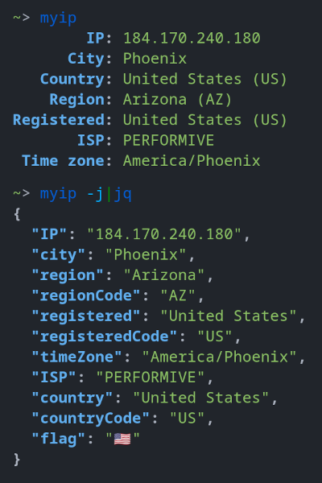

# myip

A command-line tool to query your external IP address from opendns.com and GeoIP data from local MaxMind database.



## Install

1. Install [geoipupdate](https://archlinux.org/packages/community/x86_64/geoipupdate/) and follow instractions https://dev.maxmind.com/geoip/geoipupdate/
2. Install [myip-rs](https://aur.archlinux.org/packages/myip-rs/) from AUR.

## Build

```shell
cargo build --release --locked
```
